# SciRS2 Comprehensive API Reference

[]()
[]()

Welcome to the comprehensive API reference for the SciRS2 scientific computing ecosystem. This guide provides detailed information about all modules, their APIs, and how they integrate together.

## 📋 Table of Contents

- [🏗️ Architecture Overview](#architecture-overview)
- [🔗 Cross-Module Integration](#cross-module-integration)
- [📚 Module API Reference](#module-api-reference)
- [🎯 Common Patterns](#common-patterns)
- [🔧 Configuration](#configuration)
- [⚡ Performance](#performance)
- [🔍 Error Handling](#error-handling)
- [🧪 Testing](#testing)

## 🏗️ Architecture Overview

SciRS2 follows a modular architecture with clear separation of concerns:

```mermaid
graph TD
    A[scirs2] --> B[scirs2-core]
    A --> C[Scientific Computing Modules]
    A --> D[AI/ML Modules]
    
    C --> E[scirs2-linalg]
    C --> F[scirs2-stats]
    C --> G[scirs2-optimize]
    C --> H[scirs2-signal]
    C --> I[scirs2-fft]
    C --> J[scirs2-interpolate]
    C --> K[scirs2-integrate]
    C --> L[scirs2-special]
    C --> M[scirs2-sparse]
    C --> N[scirs2-spatial]
    C --> O[scirs2-cluster]
    C --> P[scirs2-ndimage]
    C --> Q[scirs2-io]
    C --> R[scirs2-datasets]
    
    D --> S[scirs2-neural]
    D --> T[scirs2-autograd]
    D --> U[scirs2-optim]
    D --> V[scirs2-graph]
    D --> W[scirs2-transform]
    D --> X[scirs2-metrics]
    D --> Y[scirs2-text]
    D --> Z[scirs2-vision]
    D --> AA[scirs2-series]
    
    B --> BB[Core Utilities]
    B --> CC[GPU Acceleration]
    B --> DD[Memory Management]
    B --> EE[Validation]
    B --> FF[SIMD Operations]
```



### Core Design Principles

1. **Modularity**: Each module focuses on a specific domain
2. **Performance**: All modules leverage scirs2-core optimizations
3. **Safety**: Memory safety and type safety throughout
4. **Compatibility**: SciPy-compatible APIs where appropriate
5. **Extensibility**: Plugin architecture for custom algorithms

## 🔗 Cross-Module Integration

### Common Integration Patterns

#### 1. **Data Pipeline Integration**
```rust
use scirs2::prelude::*;
use ndarray::Array2;

// Load data with scirs2-io
let data = scirs2_io::load_csv("experiment.csv")?;

// Validate with scirs2-core
scirs2_core::validation::check_finite(&data, "input_data")?;

// Preprocess with scirs2-transform
let normalized = scirs2_transform::normalize::z_score(&data)?;

// Analyze with scirs2-stats
let correlation = scirs2_stats::correlation::pearson_correlation_matrix(&normalized)?;

// Cluster with scirs2-cluster
let clusters = scirs2_cluster::kmeans::kmeans(&normalized, 5, None)?;

// Visualize results (integration example)
let cluster_stats = scirs2_stats::descriptive::by_group(&data, &clusters.labels)?;
```

#### 2. **Machine Learning Workflow**
```rust
use scirs2_neural::prelude::*;
use scirs2_autograd::prelude::*;

// Feature engineering pipeline
let features = scirs2_transform::pipeline::Pipeline::new()
    .add_step(scirs2_transform::normalize::StandardScaler::new())
    .add_step(scirs2_transform::features::PolynomialFeatures::new(2))
    .fit_transform(&raw_features)?;

// Neural network with automatic differentiation
let mut model = scirs2_neural::Sequential::new()
    .dense(features.ncols(), 128)?
    .activation(scirs2_neural::activations::ReLU)
    .dense(128, 64)?
    .activation(scirs2_neural::activations::ReLU)
    .dense(64, 1)?;

// Training with scirs2-optim optimizers
let optimizer = scirs2_optim::Adam::new(0.001);
let loss_fn = scirs2_neural::losses::MSE::new();

// Train using scirs2-autograd for backpropagation
for epoch in 0..100 {
    let tape = scirs2_autograd::Tape::new();
    let predictions = tape.record(|| model.forward(&features));
    let loss = loss_fn.compute(&predictions, &targets);
    
    let gradients = tape.backward(&loss)?;
    optimizer.step(&mut model.parameters(), &gradients)?;
}
```

#### 3. **Signal Processing Pipeline**
```rust
use scirs2_signal::prelude::*;
use scirs2_fft::prelude::*;

// Load audio data
let signal = scirs2_io::load_wav("audio.wav")?;

// Apply filters from scirs2-signal
let filtered = scirs2_signal::filters::butterworth_lowpass(&signal, 1000.0, 44100.0)?;

// FFT analysis with scirs2-fft
let spectrum = scirs2_fft::rfft(&filtered)?;
let power_spectrum = spectrum.mapv(|c| c.norm_sqr());

// Peak detection and analysis
let peaks = scirs2_signal::peak_detection::find_peaks(&power_spectrum, None)?;

// Statistical analysis of spectral features
let spectral_stats = scirs2_stats::descriptive::describe(&power_spectrum)?;
```

#### 4. **Image Processing Workflow**
```rust
use scirs2_ndimage::prelude::*;
use scirs2_vision::prelude::*;

// Load image data
let image = scirs2_io::load_image("sample.png")?;

// Apply filters and morphological operations
let denoised = scirs2_ndimage::filters::gaussian_filter(&image, 1.0)?;
let edges = scirs2_ndimage::filters::sobel(&denoised)?;

// Feature detection with scirs2-vision
let corners = scirs2_vision::features::harris_corners(&denoised, 0.04)?;
let descriptors = scirs2_vision::descriptors::sift(&denoised, &corners)?;

// Clustering of detected features
let feature_clusters = scirs2_cluster::dbscan::dbscan(&descriptors, 0.5, 5)?;
```

### Cross-Module Data Types

#### Array Compatibility
All modules use compatible array types based on `ndarray`:

```rust
// Type aliases for consistency
type Array1f = ndarray::Array1<f64>;
type Array2f = ndarray::Array2<f64>;
type Array3f = ndarray::Array3<f64>;
type ArrayDf = ndarray::ArrayD<f64>;

// GPU array compatibility
use scirs2_core::gpu::GpuArray;
type GpuArray2f = GpuArray<f64, ndarray::Dim<[usize; 2]>>;
```

#### Error Type Integration
```rust
use scirs2_core::error::{CoreError, Result as CoreResult};

// Module-specific errors that integrate with core error system
#[derive(Debug, thiserror::Error)]
pub enum ModuleError {
    #[error("Core error: {0}")]
    Core(#[from] CoreError),
    
    #[error("Module-specific error: {message}")]
    ModuleSpecific { message: String },
}

type ModuleResult<T> = std::result::Result<T, ModuleError>;
```

## 📚 Module API Reference

### Core Infrastructure

#### [scirs2-core](../scirs2-core/README.md) - Foundation Module
**Essential utilities used by all other modules**

**Key APIs:**
- [`validation`](../scirs2-core/src/validation/README.md): Data validation and integrity checking
- [`gpu`](../scirs2-core/src/gpu/README.md): GPU acceleration infrastructure  
- [`memory`](../scirs2-core/src/memory_efficient/README.md): Memory management utilities
- [`simd`](../scirs2-core/src/simd_ops/README.md): SIMD acceleration
- [`parallel`](../scirs2-core/src/parallel_ops/README.md): Parallel processing

**Cross-module usage:**
```rust
// All modules use these core utilities
use scirs2_core::validation::check_positive;
use scirs2_core::error::Result;
use scirs2_core::simd_ops::SimdUnifiedOps;
```

### Scientific Computing Modules

#### [scirs2-linalg](../scirs2-linalg/README.md) - Linear Algebra
**Matrix operations, decompositions, eigensolvers**

**Key APIs:**
- `basic::*`: Matrix operations (multiply, invert, transpose)
- `decomposition::*`: SVD, QR, LU, Cholesky decompositions
- `eigen::*`: Eigenvalue and eigenvector computation
- `solve::*`: Linear system solvers

**Integration example:**
```rust
use scirs2_linalg::decomposition::svd;
use scirs2_stats::multivariate::pca;

// PCA using SVD from linalg module
let (u, s, vt) = svd(&data_matrix)?;
let pca_result = pca::from_svd(u, s, vt, n_components)?;
```

#### [scirs2-stats](../scirs2-stats/README.md) - Statistics
**Distributions, hypothesis tests, regression models**

**Key APIs:**
- `distributions::*`: Probability distributions (Normal, Gamma, etc.)
- `descriptive::*`: Summary statistics
- `hypothesis::*`: Statistical tests
- `regression::*`: Linear and nonlinear regression

**Integration example:**
```rust
use scirs2_stats::distributions::Normal;
use scirs2_cluster::kmeans;

// Statistical validation of clustering results
let normal = Normal::new(0.0, 1.0)?;
let random_data = normal.sample(1000)?;
let clusters = kmeans(&random_data, 3, None)?;
let silhouette = scirs2_metrics::clustering::silhouette_score(&random_data, &clusters.labels)?;
```

#### [scirs2-optimize](../scirs2-optimize/README.md) - Optimization
**Numerical optimization algorithms**

**Key APIs:**
- `minimize::*`: Unconstrained optimization
- `constrained::*`: Constrained optimization  
- `root::*`: Root finding
- `least_squares::*`: Least squares fitting

**Integration example:**
```rust
use scirs2_optimize::minimize::minimize;
use scirs2_neural::layers::Dense;

// Neural network training with custom optimization
let objective = |weights: &Array1<f64>| {
    model.set_weights(weights);
    let predictions = model.forward(&features);
    loss_function(&predictions, &targets)
};

let result = minimize(objective, &initial_weights, None)?;
```

### Advanced Scientific Modules

#### [scirs2-signal](../scirs2-signal/README.md) - Signal Processing
**Digital signal processing and analysis**

**Key APIs:**
- `filters::*`: Digital filters (Butterworth, Chebyshev, etc.)
- `spectral::*`: Spectral analysis
- `wavelets::*`: Wavelet transforms
- `windows::*`: Window functions

#### [scirs2-fft](../scirs2-fft/README.md) - Fast Fourier Transform
**Optimized FFT implementations**

**Key APIs:**
- `fft()`: Complex-to-complex FFT
- `rfft()`: Real-to-complex FFT
- `ifft()`: Inverse FFT
- `dct()`: Discrete cosine transform

#### [scirs2-interpolate](../scirs2-interpolate/README.md) - Interpolation
**Data interpolation and approximation**

**Key APIs:**
- `interp1d::*`: 1D interpolation
- `interpnd::*`: N-dimensional interpolation  
- `spline::*`: Spline interpolation
- `rbf::*`: Radial basis function interpolation

### AI/ML Modules

#### [scirs2-neural](../scirs2-neural/README.md) - Neural Networks
**Deep learning building blocks**

**Key APIs:**
- `layers::*`: Neural network layers (Dense, Conv2D, LSTM)
- `activations::*`: Activation functions
- `losses::*`: Loss functions
- `models::*`: Model architectures

**Cross-module integration:**
```rust
// Using neural networks with other modules
use scirs2_neural::prelude::*;
use scirs2_transform::normalize::StandardScaler;
use scirs2_metrics::regression::mean_squared_error;

// Complete ML pipeline
let scaler = StandardScaler::fit(&training_data)?;
let normalized_data = scaler.transform(&training_data)?;

let model = Sequential::new()
    .dense(input_size, 64)?
    .relu()?
    .dense(64, output_size)?;

let predictions = model.predict(&normalized_data)?;
let mse = mean_squared_error(&predictions, &targets)?;
```

#### [scirs2-autograd](../scirs2-autograd/README.md) - Automatic Differentiation
**Reverse-mode and forward-mode autodiff**

**Key APIs:**
- `Tape`: Computation graph recording
- `Variable`: Differentiable variables
- `backward()`: Gradient computation

#### [scirs2-optim](../scirs2-optim/README.md) - ML Optimization
**Machine learning optimizers**

**Key APIs:**
- `Adam`: Adam optimizer
- `SGD`: Stochastic gradient descent
- `RMSprop`: RMSprop optimizer
- `schedulers::*`: Learning rate schedulers

### Data Processing Modules

#### [scirs2-transform](../scirs2-transform/README.md) - Data Transformation
**Feature engineering and data preprocessing**

**Key APIs:**
- `normalize::*`: Data normalization
- `features::*`: Feature engineering
- `pipeline::*`: Processing pipelines

#### [scirs2-io](../scirs2-io/README.md) - Input/Output
**Scientific data format support**

**Key APIs:**
- `csv::*`: CSV file operations
- `hdf5::*`: HDF5 format support
- `matlab::*`: MATLAB file format
- `image::*`: Image file formats

## 🎯 Common Patterns

### 1. **Configuration Management**
```rust
use scirs2_core::config::{Config, ConfigBuilder};

// Global configuration
let config = ConfigBuilder::new()
    .precision(1e-12)
    .parallel_threshold(1000)
    .gpu_memory_fraction(0.8)
    .build();

scirs2_core::config::set_global_config(config);

// Module-specific configuration
let linalg_config = scirs2_linalg::Config::default()
    .with_backend(scirs2_linalg::Backend::OpenBLAS)
    .with_threads(8);
```

### 2. **Error Handling Strategy**
```rust
use scirs2_core::error::{CoreError, Result};

// Consistent error handling across modules
fn complex_computation(data: &Array2<f64>) -> Result<Array2<f64>> {
    // Validation
    scirs2_core::validation::check_finite(data, "input_data")?;
    
    // Multiple module operations with proper error propagation
    let normalized = scirs2_transform::normalize::z_score(data)
        .map_err(|e| CoreError::InvalidInput(format!("Normalization failed: {}", e)))?;
    
    let pca_result = scirs2_stats::multivariate::pca(&normalized, 5)
        .map_err(|e| CoreError::ComputationFailed(format!("PCA failed: {}", e)))?;
    
    Ok(pca_result.components)
}
```

### 3. **Performance Optimization**
```rust
use scirs2_core::{simd_ops::*, parallel_ops::*};

// Leverage core performance utilities
fn optimized_computation(data: &[f64]) -> Result<Vec<f64>> {
    // Use SIMD when beneficial
    if data.len() > 1000 && has_simd_support() {
        simd_transform(data)
    } else if data.len() > 10000 {
        // Use parallelization for large datasets
        parallel_map(data, |&x| expensive_function(x))
    } else {
        // Sequential processing for small data
        Ok(data.iter().map(|&x| expensive_function(x)).collect())
    }
}
```

### 4. **Memory Management**
```rust
use scirs2_core::memory::{ChunkProcessor, BufferPool};

// Efficient processing of large datasets
fn process_large_dataset(data: &Array2<f64>) -> Result<Array1<f64>> {
    let mut pool = BufferPool::new();
    let processor = ChunkProcessor::new(data, (1000, 1000));
    
    let results = processor.map_reduce(
        |chunk| {
            // Process chunk with temporary buffer
            let mut buffer = pool.acquire_vec(chunk.len());
            let result = process_chunk(chunk, &mut buffer);
            pool.release_vec(buffer);
            result
        },
        |partial_results| combine_results(partial_results)
    )?;
    
    Ok(results)
}
```

## 🔧 Configuration

### Global Configuration
```rust
use scirs2::config::GlobalConfig;

// Set up global configuration for all modules
GlobalConfig::builder()
    .numerical_precision(1e-12)
    .parallel_threads(num_cpus::get())
    .gpu_memory_limit_gb(8.0)
    .enable_simd(true)
    .log_level("INFO")
    .apply();
```

### Module-Specific Configuration
```rust
// Each module can have specific configuration
scirs2_linalg::set_backend(scirs2_linalg::Backend::Intel_MKL);
scirs2_neural::set_default_dtype(scirs2_neural::DType::Float32);
scirs2_gpu::set_default_device("cuda:0");
```

## ⚡ Performance

### Performance Monitoring
```rust
use scirs2_core::profiling::{Timer, MemoryTracker};

// Built-in performance monitoring
let timer = Timer::start("matrix_computation");
let memory_tracker = MemoryTracker::new();

let result = expensive_computation(&data)?;

timer.stop();
println!("Computation took: {:.2}ms", timer.elapsed_ms());
println!("Peak memory usage: {:.2}MB", memory_tracker.peak_mb());
```

### Optimization Guidelines

1. **Use appropriate data types**: `f32` vs `f64` based on precision needs
2. **Leverage SIMD**: Enable SIMD features for numerical computations
3. **Utilize GPU acceleration**: For suitable parallel workloads
4. **Memory-aware algorithms**: Use chunked processing for large datasets
5. **Profile before optimizing**: Use built-in profiling tools

## 🔍 Error Handling

### Comprehensive Error System
```rust
use scirs2_core::error::{CoreError, CoreResult, ErrorContext};

// Rich error information with context
fn robust_computation(data: &Array2<f64>) -> CoreResult<Array2<f64>> {
    data.check_finite("input_matrix")
        .with_context("Data validation failed")?;
    
    if data.is_empty() {
        return Err(CoreError::InvalidInput(
            "Cannot process empty matrix".to_string()
        ).with_location(file!(), line!()));
    }
    
    // Computation with error context
    let result = matrix_operation(data)
        .with_context("Matrix operation failed")?;
    
    Ok(result)
}
```

### Error Recovery Strategies
```rust
use scirs2_core::error::ErrorRecovery;

// Automatic error recovery
let result = risky_computation(&data)
    .or_else(|_| fallback_computation(&data))
    .or_else(|_| default_result());
```

## 🧪 Testing

### Integration Testing
```rust
#[cfg(test)]
mod integration_tests {
    use super::*;
    
    #[test]
    fn test_cross_module_integration() {
        // Test data pipeline across multiple modules
        let data = generate_test_data(100, 10);
        
        // Validate data
        assert!(scirs2_core::validation::check_finite(&data, "test_data").is_ok());
        
        // Transform data
        let normalized = scirs2_transform::normalize::z_score(&data).unwrap();
        
        // Analyze with stats
        let stats = scirs2_stats::descriptive::describe(&normalized).unwrap();
        assert!((stats.mean - 0.0).abs() < 1e-10);
        assert!((stats.std - 1.0).abs() < 1e-10);
        
        // Cluster data
        let clusters = scirs2_cluster::kmeans::kmeans(&normalized, 3, None).unwrap();
        assert_eq!(clusters.labels.len(), 100);
    }
}
```

### Property-Based Testing
```rust
use proptest::prelude::*;

proptest! {
    #[test]
    fn test_numerical_stability(
        data in prop::collection::vec(any::<f64>().prop_filter("finite", |x| x.is_finite()), 1..1000)
    ) {
        let array = Array1::from(data);
        
        // Test that operations maintain numerical properties
        let normalized = scirs2_transform::normalize::z_score(&array)?;
        let mean = scirs2_stats::descriptive::mean(&normalized);
        let std = scirs2_stats::descriptive::std(&normalized);
        
        prop_assert!((mean.abs()) < 1e-10);
        prop_assert!((std - 1.0).abs() < 1e-10);
    }
}
```

## 📈 Performance Benchmarks

### Cross-Module Performance Testing
```rust
use criterion::{criterion_group, criterion_main, Criterion};

fn benchmark_pipeline(c: &mut Criterion) {
    let data = generate_large_dataset(10000, 100);
    
    c.bench_function("full_analysis_pipeline", |b| {
        b.iter(|| {
            // Complete analysis pipeline
            let normalized = scirs2_transform::normalize::z_score(&data).unwrap();
            let pca = scirs2_stats::multivariate::pca(&normalized, 10).unwrap();
            let clusters = scirs2_cluster::kmeans::kmeans(&pca.components, 5, None).unwrap();
            clusters.labels.len()
        });
    });
}

criterion_group!(benches, benchmark_pipeline);
criterion_main!(benches);
```

## 🔗 External Integration

### Python Interoperability
```rust
use pyo3::prelude::*;

#[pyfunction]
fn scirs2_analyze(data: Vec<Vec<f64>>) -> PyResult<Vec<usize>> {
    let array = Array2::from_shape_vec((data.len(), data[0].len()), 
                                       data.into_iter().flatten().collect())
        .map_err(|e| PyErr::new::<pyo3::exceptions::PyValueError, _>(format!("{}", e)))?;
    
    let normalized = scirs2_transform::normalize::z_score(&array)
        .map_err(|e| PyErr::new::<pyo3::exceptions::PyRuntimeError, _>(format!("{}", e)))?;
    
    let clusters = scirs2_cluster::kmeans::kmeans(&normalized, 3, None)
        .map_err(|e| PyErr::new::<pyo3::exceptions::PyRuntimeError, _>(format!("{}", e)))?;
    
    Ok(clusters.labels.to_vec())
}

#[pymodule]
fn scirs2_python(_py: Python, m: &PyModule) -> PyResult<()> {
    m.add_function(wrap_pyfunction!(scirs2_analyze, m)?)?;
    Ok(())
}
```

---

## 📋 Quick Reference

### Import Patterns
```rust
// Complete ecosystem
use scirs2::prelude::*;

// Core utilities (used by all modules)
use scirs2_core::{validation::*, error::*, simd_ops::*};

// Specific modules
use scirs2_linalg::prelude::*;
use scirs2_stats::prelude::*;
use scirs2_neural::prelude::*;
```

### Common Workflows
1. **Data Loading** → `scirs2_io`
2. **Data Validation** → `scirs2_core::validation`
3. **Data Preprocessing** → `scirs2_transform`
4. **Statistical Analysis** → `scirs2_stats`
5. **Machine Learning** → `scirs2_neural` + `scirs2_autograd` + `scirs2_optim`
6. **Results Evaluation** → `scirs2_metrics`

---

**This API reference is actively maintained and updated with each release. For the latest information, see the individual module documentation and the [SciRS2 main repository](https://github.com/cool-japan/scirs).**

*Generated for SciRS2 v0.1.0-beta.1 | Last updated: 2025-06-30*