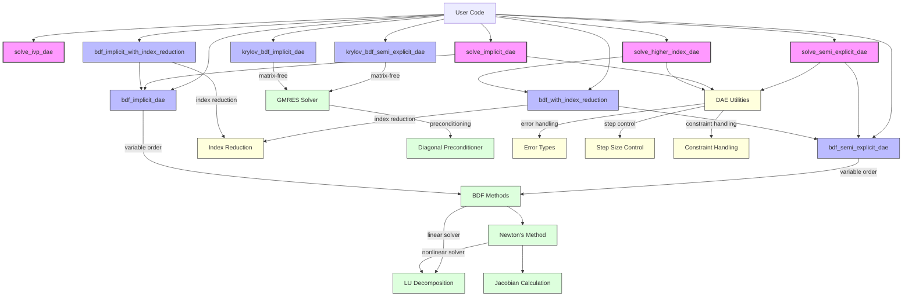

# Differential Algebraic Equations (DAE) Implementation Structure

This document provides an overview of the DAE solver implementation in `scirs2-integrate`. The diagram below shows the relationships between the different components.

## Module Organization

The DAE solver functionality is organized into the following modules:

- **Main Module** (`src/dae/mod.rs`): Central entry point that exports types and functions
- **Types Module** (`src/dae/types.rs`): Core type definitions (DAEType, DAEOptions, etc.)
- **Solvers Module** (`src/dae/solvers.rs`): Implementation of main solver functions
- **Utils Module** (`src/dae/utils.rs`): Utility functions for various DAE operations
- **Index Reduction** (`src/dae/index_reduction.rs`): Index reduction techniques
- **Methods Module** (`src/dae/methods/mod.rs`): Specialized numerical methods

The specialized methods module is further divided into:

- **BDF Methods** (`src/dae/methods/bdf_dae.rs`): Specialized BDF methods for DAEs
- **Index Reduction BDF** (`src/dae/methods/index_reduction_bdf.rs`): BDF with index reduction
- **Krylov-Enhanced BDF** (`src/dae/methods/krylov_dae.rs`): Matrix-free Krylov methods

## Usage Flow

1. User selects appropriate solver based on the DAE system type and size:
   - For general-purpose solving: `solve_semi_explicit_dae` or `solve_implicit_dae`
   - For higher-index DAEs: `solve_higher_index_dae`
   - For specialized BDF methods: `bdf_semi_explicit_dae` or `bdf_implicit_dae`
   - For higher-index with BDF: `bdf_with_index_reduction` or `bdf_implicit_with_index_reduction`
   - For large sparse systems: `krylov_bdf_semi_explicit_dae` or `krylov_bdf_implicit_dae`

2. The selected entry point configures the solver with appropriate defaults based on the provided options.

3. For semi-explicit DAEs (`x' = f(x, y, t), 0 = g(x, y, t)`):
   - Differential variables `x` and algebraic variables `y` are handled separately
   - Constraints `g(x, y, t) = 0` are satisfied at each step

4. For fully implicit DAEs (`F(t, y, y') = 0`):
   - All variables are handled uniformly
   - Derivative approximation is based on the BDF formulas

5. For higher-index DAEs:
   - Index reduction techniques transform the problem to an index-1 DAE
   - Projection methods ensure constraint satisfaction

## Implementation Details

### BDF Methods

The BDF methods use a variable-order approach:

1. Start with order 1 (Backward Euler)
2. Increase order up to a maximum (typically 5) as the solution progresses
3. Adaptive step size control based on local error estimates
4. Newton iterations for solving the nonlinear equations at each step

### Krylov-Enhanced Methods

For large sparse systems, Krylov-enhanced methods:

1. Avoid explicitly forming large Jacobian matrices
2. Use matrix-free GMRES for solving the linear systems
3. Apply simple diagonal preconditioners for improved convergence
4. Maintain the same adaptivity and error control as the standard BDF methods

### Performance Considerations

- For small to medium systems (< 100 variables): Use standard BDF methods
- For large sparse systems (≥ 100 variables): Use Krylov-enhanced methods
- For systems with explicit structure: Consider specialized preconditioners
- For higher-index DAEs: Use index reduction techniques